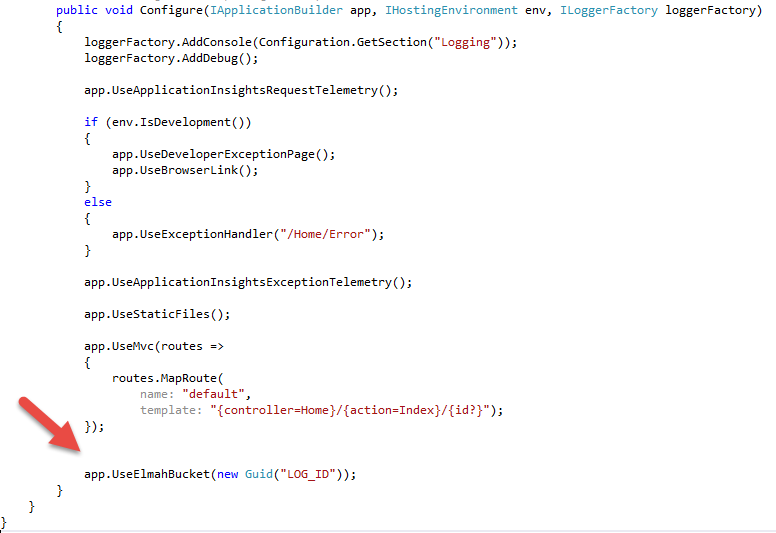
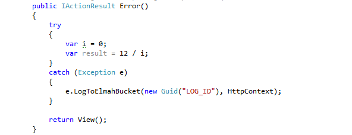

.NET Core Quick start
=====================

Installation
-------------

There are a `couple of packages <https://www.nuget.org/packages?q=Monitorr>`_ for Monitorr available on NuGet.

To install Monitorr into your **.NET Core application**, type the following command into the Package Manager Console window:

.. code-block:: powershell

   PM> Install-Package monitorr.io.dotnetcore

Using NuGet Package Manager
----------------------------

 Right-click on your project in Visual Studio and choose the ``Manage NuGet Packages`` menu item. Search for ``Monitorr`` and install the chosen package:

 .. image:: nuget_sample_1.png
    :alt: NuGet Package Manager window

Configuration
--------------

After installing the package, configure the monitorr.io logger in ``Startup.cs`` or anywhere else where the application is being initialized.

   

Manual Logging
--------------

To manually log errors to monitorr.io use the LogToMonitorr() extension and pass the LogId created at `Monitorr Admin <https://admin.monitorr.io>`_ as well as the current HTTP conext.

