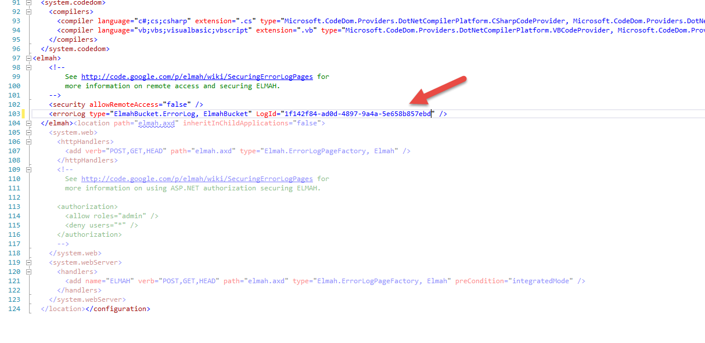
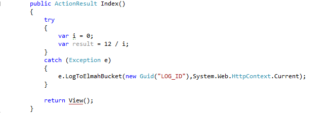

Quick start
============

Installation
-------------

There are a `couple of packages <https://www.nuget.org/packages?q=ElmahBucket>`_ for ElmahBucket available on NuGet.

To install ElmahBucket into your **ASP.NET application**, type the following command into the Package Manager Console window:

.. code-block:: powershell

   PM> Install-Package elmahbucket.io

Using NuGet Package Manager
----------------------------

 Right-click on your project in Visual Studio and choose the ``Manage NuGet Packages`` menu item. Search for ``ElmahBucket`` and install the chosen package:

 .. image:: package-manager.png
    :alt: NuGet Package Manager window

Configuration
--------------

After installing the package, open the Web.config file and paste the LogId created at `ElmahBucket Admin <https://admin.elmahbucket.io>`_.

Manual Logging
--------------

To manually log errors to elmahbucket.io use the LogToElmahBucket() extension and pass the LogId created at `ElmahBucket Admin <https://admin.elmahbucket.io>`_ as well as the current HTTP conext.

